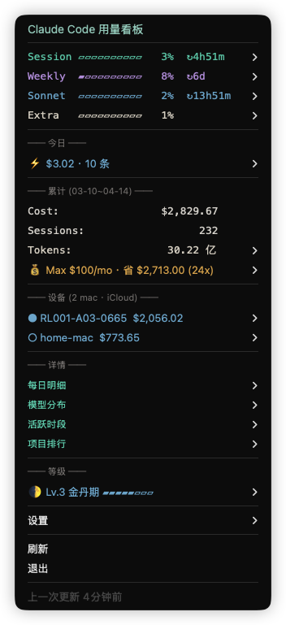
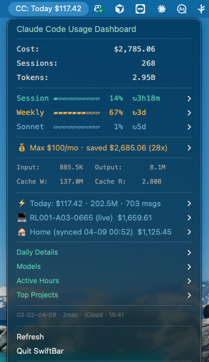
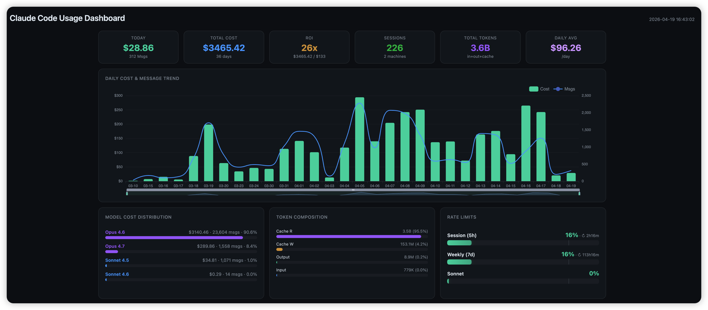
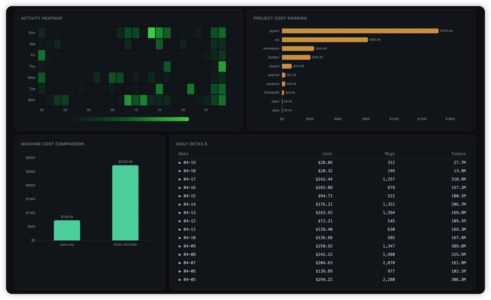
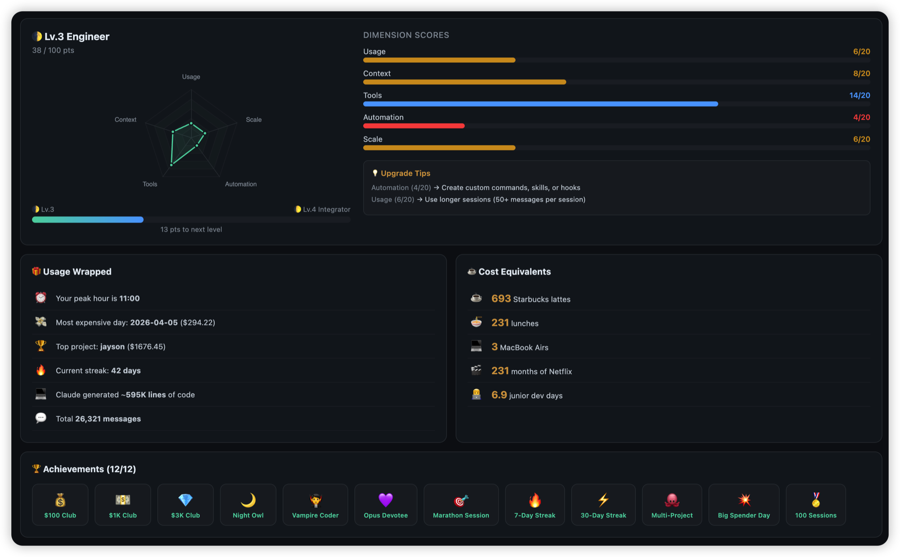

<p align="center">
  
</p>

<h1 align="center">cc-token-status</h1>

<p align="center">
  Claude Code usage dashboard in your macOS menu bar.<br/>
  Costs, plan limits, trends, user level — all in one click.
</p>

<p align="center">
  <a href="https://github.com/jayson-jia-dev/cc-token-status/releases"></a>
  <a href="https://github.com/jayson-jia-dev/cc-token-status"></a>
  <a href="https://github.com/jayson-jia-dev/cc-token-status/blob/main/LICENSE"></a>
  
  
</p>

<p align="center">
  
  &nbsp;&nbsp;
  
</p>

<p align="center">
  
</p>
<p align="center">
  
</p>
<p align="center">
  
</p>

## Quick Install

```bash
curl -fsSL https://raw.githubusercontent.com/jayson-jia-dev/cc-token-status/main/install.sh | bash
```

No dependencies to install manually. SwiftBar is auto-installed if missing.

## Why cc-token-status?

| | cc-token-status | CLI tools | Web dashboards |
|---|---|---|---|
| **See limits at a glance** | Menu bar, one click | Run a command | Open browser |
| **Official plan limits** | 5h/7d from Anthropic API | Most don't have | Some have |
| **Burn rate warning** | Auto-alert when approaching limit | No | No |
| **Multi-machine sync** | iCloud, zero config | No | No |
| **Install effort** | One command, no server | npm/pip install | Docker + server |
| **User level system** | 5-dimension scoring | No | No |

## Features

| Feature | Description |
|---------|-------------|
| **Plan Usage Limits** | Live 5h session & 7d weekly quotas with color-coded progress bars (Session/Weekly/Sonnet/Opus/Extra) |
| **Burn Rate Alert** | Warns when session pace projects to hit rate limit within 30 minutes |
| **Cost & Token Overview** | API-equivalent cost, session count, total tokens with input/output/cache breakdown |
| **Today + Trend** | Today's spending with trend vs 30-day active-day average (↑12% when above average) |
| **Subscription ROI** | How much your Pro/Max/Team plan saves vs API pricing, with daily/monthly projections |
| **User Level** | 🌑→🌒→🌓→🌔→🌕→👑 rank with progress bar and upgrade hints |
| **Visual Dashboard** | Click to open 12-panel ECharts report in browser: cost trend, model distribution, hourly activity, project ranking, token composition, rate limit gauges, machine comparison, daily detail table |
| **Daily Details** | Full cost history (newest first, older dates collapsible) |
| **Model Breakdown** | Per-model usage (Opus / Sonnet / Haiku) with percentages |
| **Hourly Activity** | Sparkline charts: `▅▇██▇▄` shows which hours you're most active |
| **Project Ranking** | Which projects consume the most tokens |
| **Multi-Machine Sync** | iCloud Drive auto-sync across Macs — zero config |
| **Usage Alerts** | One macOS push per escalation (80 → 95 → 100 + burn). No re-firing on window rollover or same-tier repeats. Burn is suppressed once already at 100% |
| **Extra Usage** | Shows extra usage gauge with spent amount, monthly limit, and on/off status when enabled |
| **Session Retention Protection** | Claude Code by default silently deletes `~/.claude/projects/**/*.jsonl` older than 30 days, wiping your cost history. On every refresh we patch `cleanupPeriodDays` to `99999` so your data stays put. [Background](https://simonwillison.net/2025/Oct/22/claude-code-logs/) |
| **Accurate Cost (msg.id dedup)** | Claude Code re-logs the same API response on session resume/continue. Without dedup, cost inflates 40–80%. Plugin deduplicates globally by `msg.id` so numbers match Anthropic's billing |
| **Fleet Aggregation** | With iCloud sync, menu's Daily / Hourly / Projects / Models panels aggregate across all your Macs. Only the Machines panel breaks down per-device |
| **TTL-Aware Cache Pricing** | Reads `usage.cache_creation.ephemeral_{5m,1h}_input_tokens` and prices each TTL at its official rate ($×1.25 for 5m, $×2 for 1h) |
| **Auto-Update** | Daily background check + on-demand "Manual Update" menu button. SHA256-verified, proxy-aware (system HTTP/HTTPS proxy), downgrade-protected, atomic replace, self-heals stray plugin copies on every run |
| **5 Languages** | EN, 中文, ES, FR, 日本語 — auto-detected from system |
| **Dark & Light Mode** | Adapts color scheme to macOS appearance |

## User Level System

Multi-dimension scoring based on your Claude Code usage maturity:

```
🌑 Lv.1  Starter      练气期
🌒 Lv.2  Planner      筑基期
🌓 Lv.3  Engineer     金丹期
🌔 Lv.4  Integrator   元婴期
🌕 Lv.5  Architect    化神期
👑 Lv.6  Orchestrator 大乘期
```

Scored across 5 dimensions (100 points total):
- **Usage depth** — median session length, activity density
- **Context management** — CLAUDE.md, memory system, rules
- **Tool ecosystem** — MCP servers, plugins (work tools discounted)
- **Automation** — self-built commands, hooks, skills (framework installs weighted at 30%)
- **Scale** — substantial projects, worktrees, tenure

## How It Works

```
┌──────────────────────────────────────────────────────────────────┐
│  SwiftBar (5-min refresh)                                        │
│   ↓                                                              │
│  cc-token-stats.5m.py                                            │
│   ├─ ensure_cleanup_disabled() → patch cleanupPeriodDays → 99999 │
│   ├─ scan()        → parse ~/.claude/projects/*/*.jsonl          │
│   │                  (msg.id dedup + TTL-aware pricing           │
│   │                   + incremental mtime fingerprint cache)     │
│   ├─ get_usage()   → Anthropic OAuth API (9-min fresh, 2h stale) │
│   │                  ↳ macOS Keychain → OAuth token              │
│   ├─ save_sync()   → write full state to iCloud Drive            │
│   ├─ load_remotes()→ trust other machines' written values        │
│   ├─ auto_update() → GitHub + SHA256 (24h throttle)              │
│   └─ check_and_notify() → one push per escalation, no spam       │
└──────────────────────────────────────────────────────────────────┘
```

- **Session retention protection** — before anything else, patches `~/.claude/settings.json` so Claude Code's 30-day default auto-deletion can't wipe your cost history
- **Token & cost** — scans Claude Code JSONL session logs with incremental caching (only re-parses changed files), globally deduplicates by Anthropic `msg.id` so session resume/continue rewrites are counted once, splits cache-write pricing by TTL (`ephemeral_5m` × 1.25 vs `ephemeral_1h` × 2 of input rate)
- **Plan limits** — reads OAuth token from macOS Keychain, queries `api.anthropic.com/api/oauth/usage` with smart caching (9-min fresh + 2-hour stale fallback, HTTP 429 graceful degradation)
- **Rate-limit alerts** — one notification per escalation per limit-type; `state = {limit_key: {tier, at}}` survives 5h/7d window rollovers so the same threshold doesn't re-fire. Burn-rate prediction suppressed once already blocked
- **Auto-update** — daily GitHub check with SHA256 verification, atomic tmp+rename, system proxy fallback, downgrade-protected; failures logged to `~/.config/cc-token-stats/.update.log` for diagnosis
- **Multi-machine sync** — writes full stats (including `daily_models`, `daily_hourly`, `sessions_by_day`) to iCloud Drive; reads peers' written values as-is (no re-pricing approximation) so header and Daily合计 stay exactly consistent
- **Dashboard** — generates self-contained HTML with embedded ECharts, opens in browser (12 panels, all data from local caches)
- **Refresh** — SwiftBar executes the plugin every 5 minutes

## Pricing

| Model | Input | Output | Cache Write (1h) | Cache Read |
|-------|-------|--------|-----------------|------------|
| Opus 4.5 / 4.6 / 4.7 | $5 | $25 | $10 | $0.50 |
| Sonnet 4.5 / 4.6 | $3 | $15 | $6 | $0.30 |
| Haiku 4.5 | $1 | $5 | $2 | $0.10 |

*USD per 1M tokens. [Official pricing](https://platform.claude.com/docs/en/about-claude/pricing)*

## Configuration

Edit `~/.config/cc-token-stats/config.json` or use the in-app Settings menu:

| Key | Description | Default |
|-----|-------------|---------|
| `subscription` | Monthly plan cost in USD | `0` |
| `subscription_label` | `"Pro"`, `"Max"`, `"Team"` | `""` |
| `language` | `"auto"`, `"en"`, `"zh"`, `"es"`, `"fr"`, `"ja"` | `"auto"` |
| `notifications` | Usage limit alerts | `true` |
| `auto_update` | Daily background update check (menu button "Check for Updates Now" still works when off) | `true` |
| `sync_mode` | `"auto"` / `"off"` | `"auto"` |
| `machine_labels` | Custom device names, e.g. `{"RL001":"Office"}` | `{}` |

## Update

Three paths, same SHA256 verification and atomic replace:

1. **Automatic** — daily background check, no action needed (default)
2. **Menu button** — Settings → "Check for Updates Now" (bypasses the 24h throttle, shows result as a notification)
3. **Reinstall script**:
   ```bash
   curl -fsSL https://raw.githubusercontent.com/jayson-jia-dev/cc-token-status/main/install.sh | bash -s -- --update
   ```

### Stuck on an old version?

The dropdown title shows your current version (e.g. `v1.5.11`). If auto-update has silently failed for 3+ days, a `⚠️` appears in the title and you'll get a one-shot macOS notification. To force-repair from any state:

```bash
curl -fsSL https://raw.githubusercontent.com/jayson-jia-dev/cc-token-status/main/install.sh | bash
```

Update diagnostics live at `~/.config/cc-token-stats/.update.log` (rotated at 50 KB).

## Versioning

Standard 3-segment [SemVer](https://semver.org):

- **MAJOR** — breaking config or behavior change
- **MINOR** — new user-facing feature (menu item, setting, dashboard panel)
- **PATCH** — bug fix or internal hardening

See [Releases](https://github.com/jayson-jia-dev/cc-token-status/releases) for per-version notes.

## Uninstall

```bash
curl -fsSL https://raw.githubusercontent.com/jayson-jia-dev/cc-token-status/main/uninstall.sh | bash
```

## Requirements

- macOS
- [Claude Code](https://docs.anthropic.com/en/docs/claude-code/overview)
- Python 3.8+
- [SwiftBar](https://github.com/swiftbar/SwiftBar) (auto-installed)

## License

MIT
